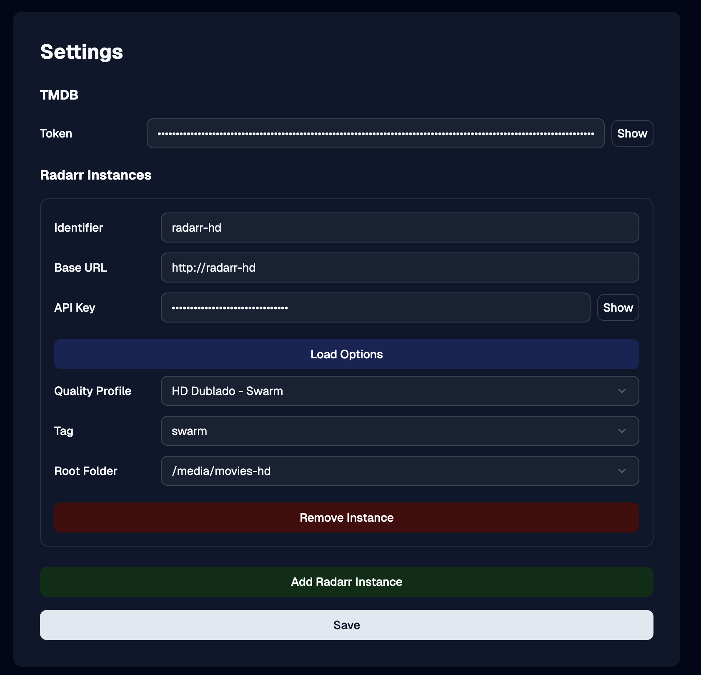

# mediaddrr

mediaddrr is a web application designed to receive webhooks from [autobrr](https://autobrr.com/) and add the requested media to your other `arr` app instances. Currently, it supports adding **movies** to [Radarr](https://radarr.video/).

## Main Features

1. Add NEW Movies into Radarr based on "Title + Year" query (as autobrr webhook).
2. Filter which new movies can be added using some TMDB query filters, like vote average, minimum votes, and popularity (Avoid adding awful releases)
3. Push release to Radarr with text-transformation (So releases will follow YOUR desired pattern)

It also allows you making mediaddr an RSS-server proxy with text-transformation, but I think it will be deprecated, as pushing the release with text-transformation will work with any kind of feed. 

---

## Getting Started

### 1. Run the app

To run mediaddrr using Docker Compose:

1. Make sure you have [Docker](https://docs.docker.com/get-docker/) and [Docker Compose](https://docs.docker.com/compose/install/) installed.
2. In your project directory, start the app with:
   ```sh
   docker-compose up -d
   ```
3. The app will be available at `http://localhost:3000` by default (or replace `3000` with the port configured in your `docker-compose.yml`).
4. Navigate to the home page to configure your settings.

### 2. Fill in the Settings

After starting the app, navigate to the Settings page to configure mediaddrr:

#### a. TMDB Token

- Obtain your TMDB API Read Access Token from [https://www.themoviedb.org/settings/api](https://www.themoviedb.org/settings/api).
- Copy the token as shown in the image below:

  

- Paste the token into the **TMDB Token** field in the app settings.

#### b. Radarr Instances

- For each Radarr instance you want to connect:

  - Enter a unique **Identifier** (e.g., `radarr-hd`). This will be used in autobrr to identify which instance the movie must be added to.
  - Set the **Base URL** your applications access radarr (e.g., `http://radarr-hd` in a docker compose stack, but might be your IP and port).
  - Enter your Radarr **API Key**. You can find this in your Radarr settings as shown below:

    

- After entering the Base URL and API Key, click the `Load Options` button. This will populate the available Quality Profiles, Tags, and Root Folders for your Radarr instance.
- Select the desired options for each field.

  

- Click **Save** when you are done configuring your settings.

### 3. Setting up the Webhook in autobrr

Add a webhook in autobrr with the following settings:

- **URL:**

  ```
  http://mediaddrr:3000/api/radarr/[instance-id]/addMovie
  ```

  Replace `[instance-id]` with the ID of your Radarr instance as configured in the settings step (e.g., `radarr-uhd` or `radarr-hd`).

  **Note:** Be sure to replace `mediaddrr:3000` with the correct host and port for your setup (e.g., `localhost:3000` or your server's address).

  

- **Body:**
  ```json
{
    "query": "{{.Title}}",
    "year": "{{.Year}}",
    "release": {
        "title": "{{.TorrentName}}",
        "infoUrl": "{{.InfoUrl}}",
        "downloadUrl": "{{.DownloadUrl}}",
        "size": "{{.Size}}",
        "indexer": "{{.IndexerIdentifierExternal}}",
        "downloadProtocol": "{{.Protocol}}",
        "protocol": "{{.Protocol}}"
    }
}
  ```
You can also add `"tmdbId": {{ .Tags }}` if some of your trackers support tmdbId on the parsing. The API supports both query-based search (`query` + `year`) and direct TMDB ID lookup (`tmdbId`).

---

## Additional Features

### Text Transformation Patterns

Text Transformation Patterns allow you to transform text using regex-based variable extraction and replacement. This is useful for indexers that does not follow a good standard for their release names, or, in such cases that they do not follow your very detailed custom formats.

- For each pattern you want to create:

  - Enter a unique **Pattern Identifier** (e.g., `bjshare-pattern`).
  - Define **Variables** that extract information from input text:
    - **Variable Name**: A unique name for the variable (e.g., `title`, `year`).
    - **From**: Optional. The name of another variable to use as input (leave empty to use the original input).
    - **Regex**: A regular expression pattern to match and extract data.
    - **Replace With**: The replacement pattern (use `$1`, `$2`, etc. for capture groups).
  - Set the **Output Template**: A template string using `${variableName}` syntax to format the final output.
  - Set the **Aliases**: A comma-separated list of ignore case "indexer identifier" you use on autobrr with this pattern, used for automated release pushing.

- Example pattern structure:
  - Variables extract `year` and `title` from input text like `[2024] Movie Title [1080p]`.
  - Output template: `${title} [${year}] ${meta}` produces `Movie Title [2024] 1080p`.

- You can test your patterns using the **Pattern Tester** page (accessible via the "Pattern Tester" button on the Settings page).

See the Sanitize API Endpoint section below for further information.

> **Important:**
> Any release that will be pushed through radarr using mediaddrr will use the external indexer identifier to match on which pattern must be executed. If a corresponding alias is found in the patterns, it will execute on the release string before forwarding to Radarr. This is what allows text-transformation to be executed with any type of feed.

### Pattern Tester

The Pattern Tester page (`/patternTester`) allows you to test your patterns interactively:

1. Enter sample input text that you want to transform.
2. Select a pattern from your configured patterns.
3. Click "Test Pattern" to see:
   - Extracted variables and their values
   - The final output after transformation

This is useful for debugging and refining your patterns before using them in production.

### Sanitize API Endpoint

The sanitize endpoint allows you to programmatically transform text using patterns:

**GET Request:**
```
GET /api/sanitize/[pattern-id]?input=your+text+here
```

**POST Request:**
```
POST /api/sanitize/[pattern-id]
Content-Type: text/plain

your text here
```

Both methods return the transformed text as plain text. The pattern ID must match one of your configured patterns.

### RSS Feeds

RSS feeds can be processed and transformed using patterns before being served to clients.

- For each RSS feed you want to configure:

  - Enter a unique **RSS Feed Identifier** (e.g., `tracker-rss`).
  - Set the **RSS Feed URL** (the source RSS feed to process).
  - Configure **Tag Mappings**: Map XML tag names (e.g., `title`, `description`) to pattern identifiers that will transform those tags.

- Access the processed RSS feed at:
  ```
  http://mediaddrr:3000/api/rss/[rss-id]
  ```
  Replace `[rss-id]` with your RSS feed identifier.

- The processed feed will have all mapped tags transformed according to their assigned patterns.

---

## Conclusion

mediaddrr streamlines the process of connecting autobrr with your Radarr instances, making automated media addition simple and reliable. If you have suggestions, encounter issues, or want to contribute, please open an issue or pull request on GitHub. Your feedback and contributions are welcome!
